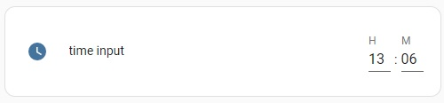

# lovelace-24h-time-input-row

A custom Home Assistant card to set the time of a datetime entity in 24 hour format.

# Manual installation

Download and copy the `24h-time-input-row.js` file to the `\config\www\<your-location>` folder and add `\local\<your-location>\24h-time-input-row.js` to the resources.

# Configuration

Add to your lovelace Yaml the following:

```yaml
  type: custom:24h-time-input
  entity: datetime_input.example_helper
  icon: mdi:clock
  name: time input
```

This can also be used in for example the enitities card.
The name and icon are optional settings.

# Example

```yaml
type: entities
entities:
  - type: custom:24h-time-input
    entity: datetime_input.example_helper
    icon: mdi:clock
    name: time input
 ```
 
 
